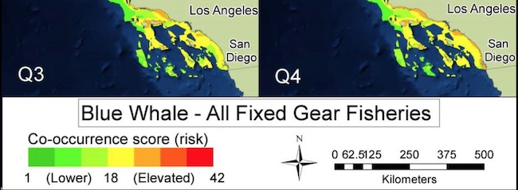
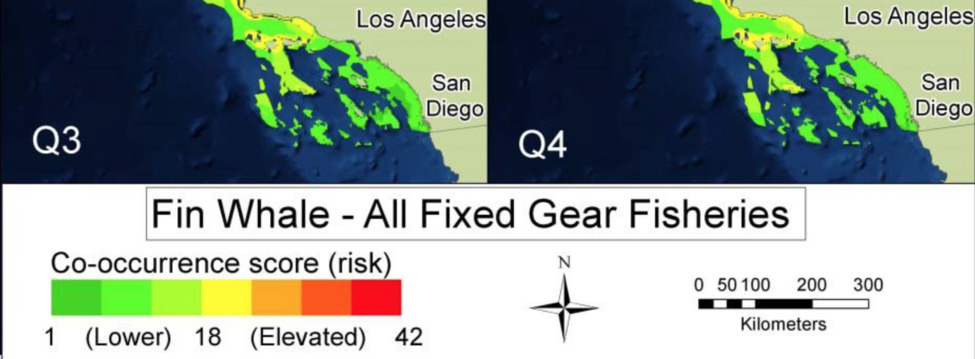

### Whale entanglement

![**Figure App.C.4.10.** Annual number of large whale entanglements reported (blue) and confirmed (red) along the U.S. West Coast. Reports of entanglements have increased in recent years. Factors contributing to this trend likely include an increasing overlap of whale activities (e.g., migrating, feeding) with human activities that have the potential to entangle whales (e.g., fishing, buoy installation) and an increase in on-the-water observers likely to report entangled individuals (e.g., whale watching, recreational boating). Confirmed entanglements from 2000 to 2015 of gray and humpback whales include 11 from Santa Barbara and two from Ventura counties. Figure: D. Lawson/NMFS WCRO PRD](../img/cinms_cr/App.C.4.10.Whale_entanglements.png)
 
#### Overlap with Fishing {.tabset}

##### Blue

##### Fin

##### Humpback

####

**Figure App.C.4.11.** Co-occurrence score (risk) based on multi-year average whale density and fishing effort for 11 fisheries is shown for quarters three (Q3) and four (Q4) for blue (top), fin (middle), and humpback (bottom) whales. In Santa Barbara from July to December, there is an elevated risk area for multiple whale species with the California halibut/white seabass set gillnet, hagfish trap, rock crab trap, sablefish, spiny lobster trap, and spot prawn trap fisheries. Figure: Saez et al. 2013