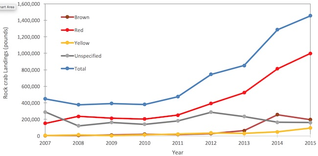
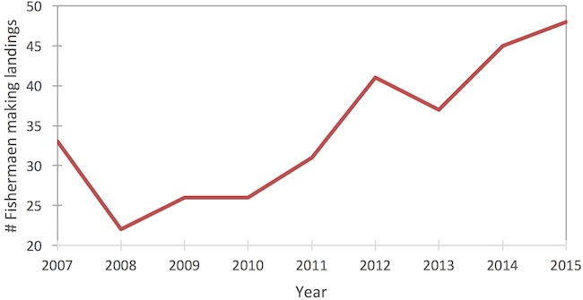

### Rock Crabs {.tabset} 

#### Landings 

#### Fishers

##

**Figure App.C.4.6.** Commercial fishing activity for rock crabs has increased recently in blocks around Channel Islands National Marine Sanctuary. Landings of rock crabs have increased since 2010 (top) and the number of fishers landing crab has increased since 2008 (bottom). Commercial rock crab data from blocks 683–691, 706–714, 744–745, and 764–765 (see Figure App.C4.3 for map of blocks). Data source: CDFW; Figure: NOAA