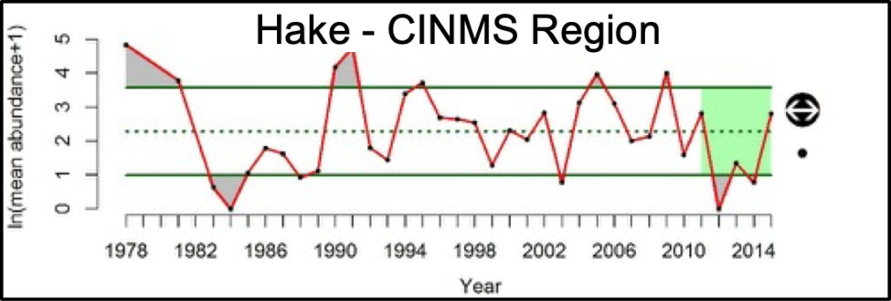
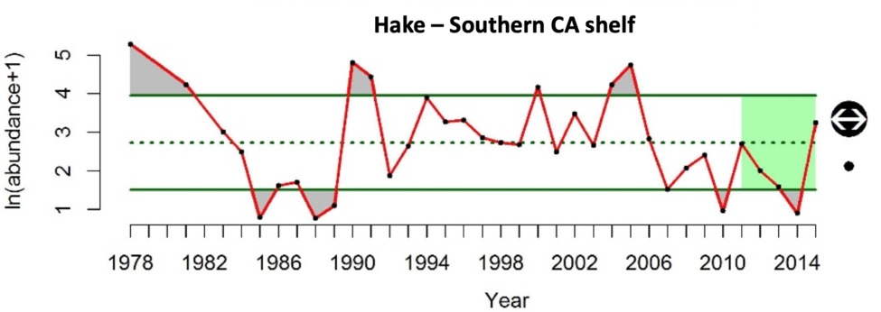

```{r, include=F}
knitr::opts_chunk$set(echo=F, message=F, warning=F, error=F)

library(glue)
source(here::here("scripts/calcofi.R"))
source(here::here("scripts/utility.R"))
```

## {.tabset}

### Map of Regions

```{r, fig.cap=md_caption("Figure App.F.12.17.new")}
calcofi_map()
```

### Anchovies {.active}

#### CINMS Region

```{r}
grp   <- "Anchovy"
rgn   <- "CINMS"

title <- glue("{grp} - {rgn} Region")
csv   <- glue("https://raw.githubusercontent.com/marinebon/calcofi-analysis/master/data/{grp}_{rgn}.csv")

calcofi_plot(csv = csv, title = title)
```

#### SoCal Shelf Region

```{r}
grp   <- "Anchovy"
rgn   <- "SoCal Shelf"

title <- glue("{grp} - {rgn} Region")
csv   <- glue("https://raw.githubusercontent.com/marinebon/calcofi-analysis/master/data/{grp}_{rgn}.csv")

#download.file(csv, "_tmp.csv")
calcofi_plot(csv = csv, title = title)
```


`r md_caption("Figure App.F.12.19")`

### Hake

#### CINMS Region



#### SoCal Shelf Region



`r md_caption("Figure App.F.12.19")`

### Myctophids

#### CINMS Region

```{r}
grp   <- "Myctophids"
rgn   <- "CINMS"

title <- glue("{grp} - {rgn} Region")
csv   <- glue("https://raw.githubusercontent.com/marinebon/calcofi-analysis/master/data/{grp}_{rgn}.csv")

calcofi_plot(csv = csv, title = title)
```

#### SoCal Shelf Region

```{r}
grp   <- "Myctophids"
rgn   <- "SoCal Shelf"

title <- glue("{grp} - {rgn} Region")
csv   <- glue("https://raw.githubusercontent.com/marinebon/calcofi-analysis/master/data/{grp}_{rgn}.csv")

calcofi_plot(csv = csv, title = title)
```


`r md_caption("Figure App.F.12.19")`

### Rockfish

#### CINMS Region

```{r}
grp   <- "Rockfish"
rgn   <- "CINMS"

title <- glue("{grp} - {rgn} Region")
csv   <- glue("https://raw.githubusercontent.com/marinebon/calcofi-analysis/master/data/{grp}_{rgn}.csv")

calcofi_plot(csv = csv, title = title)
```

#### SoCal Shelf Region

```{r}
grp   <- "Rockfish"
rgn   <- "SoCal Shelf"

title <- glue("{grp} - {rgn} Region")
csv   <- glue("https://raw.githubusercontent.com/marinebon/calcofi-analysis/master/data/{grp}_{rgn}.csv")

calcofi_plot(csv = csv, title = title)
```


`r md_caption("Figure App.F.12.19")`

### Sanddab

#### CINMS Region

```{r}
grp   <- "Sanddab"
rgn   <- "CINMS"

title <- glue("{grp} - {rgn} Region")
csv   <- glue("https://raw.githubusercontent.com/marinebon/calcofi-analysis/master/data/{grp}_{rgn}.csv")

calcofi_plot(csv = csv, title = title)
```

#### SoCal Shelf Region

```{r}
grp   <- "Sanddab"
rgn   <- "SoCal Shelf"

title <- glue("{grp} - {rgn} Region")
csv   <- glue("https://raw.githubusercontent.com/marinebon/calcofi-analysis/master/data/{grp}_{rgn}.csv")

calcofi_plot(csv = csv, title = title)
```


`r md_caption("Figure App.F.12.19")`

### Sardines

#### CINMS Region

```{r}
grp   <- "Sardine"
rgn   <- "CINMS"

title <- glue("{grp} - {rgn} Region")
csv   <- glue("https://raw.githubusercontent.com/marinebon/calcofi-analysis/master/data/{grp}_{rgn}.csv")

calcofi_plot(csv = csv, title = title)
```

#### SoCal Shelf Region

```{r}
grp   <- "Sardine"
rgn   <- "SoCal Shelf"

title <- glue("{grp} - {rgn} Region")
csv   <- glue("https://raw.githubusercontent.com/marinebon/calcofi-analysis/master/data/{grp}_{rgn}.csv")

calcofi_plot(csv = csv, title = title)
```


`r md_caption("Figure App.F.12.19")`

