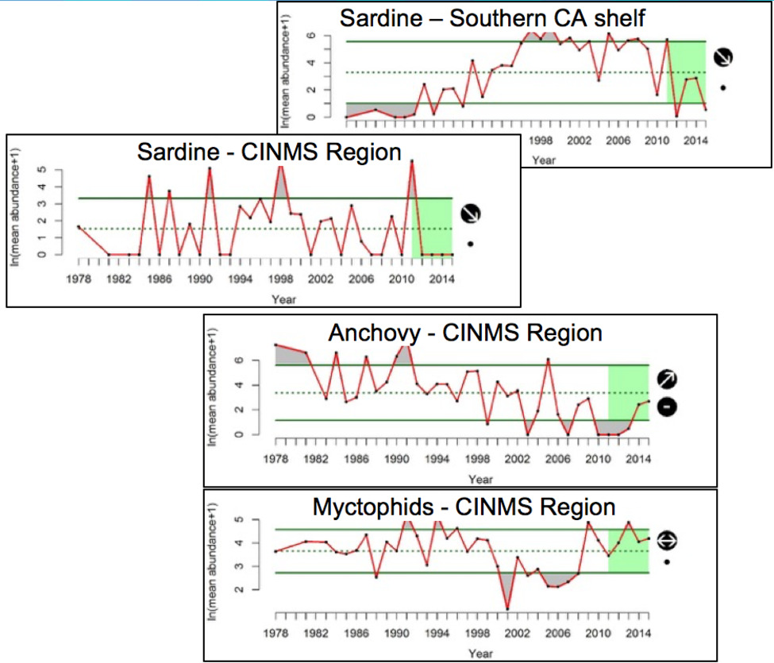
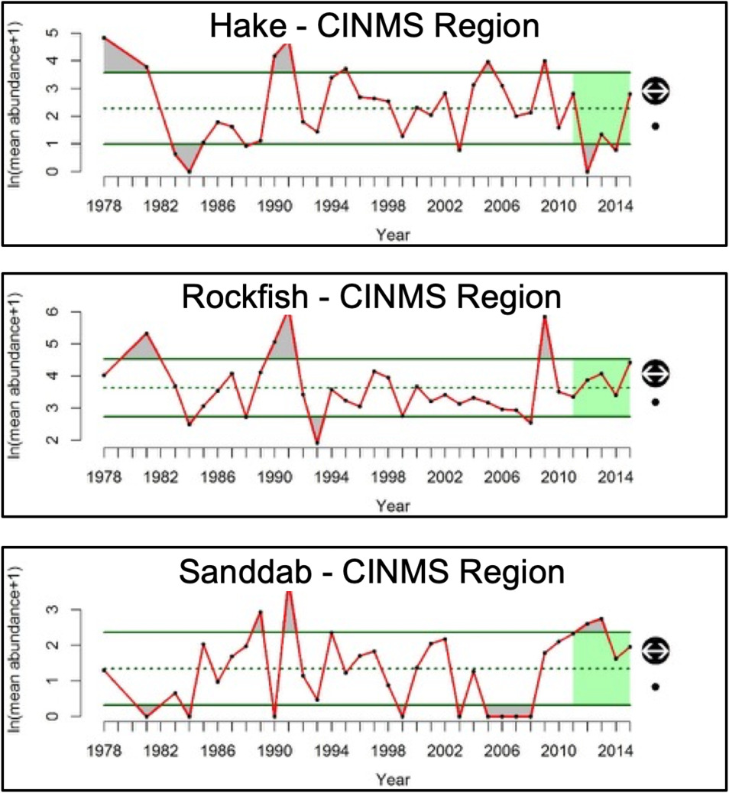

## By energy density {.tabset}

### High 

### Medium 

##

**Figure App.F.12.19.** Relative abundance of key forage groups collected in net samples during spring CalCOFI cruises at sites in the Channel Islands National Marine Sanctuary (CINMS) region from 1978 to 2015. Forage is grouped by high (left panel) and medium (right panel) energy density. High energy taxa are Pacific sardines, northern anchovies, and and Myctophids. Medium-energy taxa are Pacific hake, shortbelly rockfish, and sanddabs. Although sardine were completely absent in net samples from 2011 to 2014 in the CINMS region, comparison with samples collected in the larger Southern California Shelf region reveal that sardine were at very low abundance but not completely absent from the region (sampling locations shown in Figure App.F12.17). Symbols on graph explained in the caption of Figure App.F12.18. Data source: CalCOFI; Figure: A. Thompson/NOAA