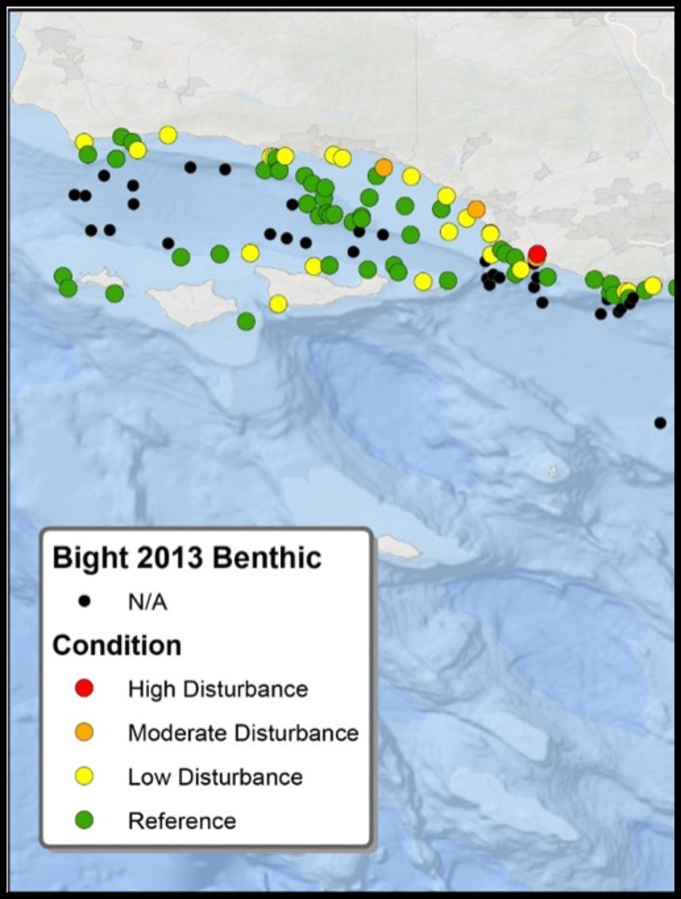

```{r, include=F}
knitr::opts_chunk$set(echo=F, message=F, warning=F, error=F)
source(here::here("scripts/utility.R"))
```

## {.tabset}

### Deeper water fish - effective number of species


### Deep-sea corals - estimated species richness


### Infaunal invertebrates - community composition




### Demersal fishes - biodiversity trends


