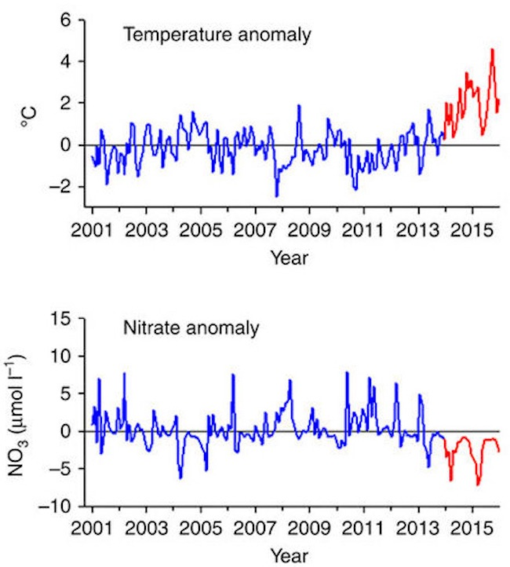

preserve42f3616f2f405744

# {.tabset}

## Temperature {.tabset}
### Map: Satellite-based SST (CoastWatch)

preservec64c1b10ed3366e8

Map of the most recent sea-surface temperature around the Sanctuary.

  
Click for Details

The sea-surface temperature dataset collected via satellite is the <a href='https://coastwatch.pfeg.noaa.gov/erddap/info/jplMURSST41mday/index.html' target='_blank'>Multi-scale Ultra-high Resolution (MUR) SST Analysis fv04.1, Global, 0.01°, 2002-present, Monthly</a> curated by NOAA's <a href='https://oceanview.pfeg.noaa.gov/projects' target='_blank'>Environmental Research Division</a> (ERD) and served to this website live as a web map service (WMS) from the <a href='https://coastwatch.pfeg.noaa.gov/erddap/index.html' target='_blank'>CoastWatch ERDDAP</a> server. For more information, consult Figure Ux.Ocean.SST.ERD.map in the [CINMS 2016 Condition Report](https://nmssanctuaries.blob.core.windows.net/sanctuaries-prod/media/docs/2016-condition-report-channel-islands-nms.pdf){target="_blank"}.

### Trend: Satellite-based SST (CoastWatch)

preserve5a4a7e4d773790dc

The average sea-surface temperature over time across the Sanctuary. The gray bar at the bottom of the figure can be used to zoom in to specific dates, using the small slider buttons on either edge of the gray bar. In the figure, the dark red line is the average temperature, while the lighter pink area indicates the standard deviation of that temperature across the Sanctuary.

  
Click for Details

The sea-surface temperature dataset collected via satellite is the <a href='https://coastwatch.pfeg.noaa.gov/erddap/info/jplMURSST41mday/index.html' target='_blank'>Multi-scale Ultra-high Resolution (MUR) SST Analysis fv04.1, Global, 0.01°, 2002-present, Monthly</a> curated by NOAA's <a href='https://oceanview.pfeg.noaa.gov/projects' target='_blank'>Environmental Research Division</a> (ERD) and served to this website live as a web map service (WMS) from the <a href='https://coastwatch.pfeg.noaa.gov/erddap/index.html' target='_blank'>CoastWatch ERDDAP</a> server. For more information, consult Figure Ux.Ocean.SST.ERD.timeseries in the [CINMS 2016 Condition Report](https://nmssanctuaries.blob.core.windows.net/sanctuaries-prod/media/docs/2016-condition-report-channel-islands-nms.pdf){target="_blank"}.

Download timeseries data for sanctuary: preservea085087a5fabb307

### Trend: SST anomaly (SBC LTER)
### Trend: Temperature profile (PnB)

  
Click for Details

Time-series of temperature (°C) profiles at Plumes and Blooms sampling station #4 (34°15.01'N, 119°54.38'W, see Figure D6.2) for (a) 1997-2015 and (b) 2009-2015. While station #4 is outside the sanctuary boundary and there are other sampling sites within the sanctuary, it is the only sampling site that collects measurements throughout the water column, versus from just surface waters. This time-depth contour plot was generated via ordinary krigging with a generalized exponential-Bessel fitting model (GLOBEC Kriging Software Package v3.0), with interpolation length scales of 30 days (time axis) and ten meters (depth axis). The time and location of each actual sample are shown as black dots, allowing the observation of periods where data gaps exist. Note: This is variant of a similar figure shown during the expert workshop. For more information, consult Figure App.D.8.4 in the [CINMS 2016 Condition Report](https://nmssanctuaries.blob.core.windows.net/sanctuaries-prod/media/docs/2016-condition-report-channel-islands-nms.pdf){target="_blank"}.

## Acidification {.tabset}
#### Aragonite saturation

<a href="https://sanctuarysimon.org/dbtools/project-database/index.php?ID=100462" target="_blank"><i class="fa fa-clipboard-list"></i>
        Monitoring Program</a>

<a href="http://doi.org/10.13140/RG.2.1.3430.4085" target="_blank"><i class="fa fa-database"></i>
        Etnoyer et al. 2015</a>

  
Click for Details

Aragonite saturations are shown at 75 meters (m) (green), 150 m (blue) and 300 m (red) at Anacapa Island. As pH of seawater decreases (e.g., from the deposition of atmospheric CO2), the saturation state of aragonite (Ωarg) decreases. Aragonite undersaturation (Ωarg < 1) favors dissolution over calcification, making it harder for organisms to make and maintain their shells or skeletons in the case of corals. In coastal upwelling zones, such as the California Current, the aragonite saturation state and depth are variable and shallow, respectively. With ocean acidification, aragonite saturation depths have shoaled over the past three decades and are now typically around 200 m in the California Current (Turi et al. 2016). At the local scale at Anacapa Island, the aragonite saturation depth has hovered around 130 m over the past eight years. As strong of a shoaling trend as at the California Current scale has not been seen. Instead, the usual seasonal variation but relatively stable aragonite saturation states over time (no trend), particularly in deep water, have been seen. For more information, consult Figure App.E.10.29 in the [CINMS 2016 Condition Report](https://nmssanctuaries.blob.core.windows.net/sanctuaries-prod/media/docs/2016-condition-report-channel-islands-nms.pdf){target="_blank"}.

## Harmful Algal Blooms {.tabset}

#### Trends: Domoic Acid Levels (2012-13)

<a href="https://sanctuarysimon.org/dbtools/project-database/index.php?ID=100429" target="_blank"><i class="fa fa-clipboard-list"></i>
        Plumes and Blooms Monitoring Program</a>

![A figure showing domoic acid levels in commercially-important crustaceans (triangles) and bivalves (circles) collected from the Santa Barbara Channel (2012 - 2013). Red coloration indiciates that the domic acid levels measured above the California Department of Public Health and U.S. Food and Drug Administration action limits. Figure credit: <a href='https://caseagrant.ucsd.edu/profile/carolynn-culver' target='_blank'>C. Culver/CA Sea Grant</a>, unpublished data.](../img/cinms_cr/App.D.7.1_DA levels in crustaceans and bivalves in 2012 and 2013_C. Culver CA Sea Grant copy.jpg)

  
Click for Details

Domoic acid levels in parts per million (ppm) in commercially-important crustaceans (triangles) and bivalves (circles) collected from the Santa Barbara Channel between 2012 and 2013 are shown on the y-axis for (A) animals collected near the shore of the mainland coast, and (B) animals collected offshore the mainland coast or near the northern Channel Islands. In the cases that are colored red, domoic acid levels measured above the California Department of Public Health and U.S. Food and Drug Administration action limits: 20 ppm for meat and 30 ppm for viscera. For more information, consult Figure App.D.7.1 in the [CINMS 2016 Condition Report](https://nmssanctuaries.blob.core.windows.net/sanctuaries-prod/media/docs/2016-condition-report-channel-islands-nms.pdf){target="_blank"}.

#### Map: Harmful Algal Bloom (2015)

<a href="https://doi.org/10.1002/2016GL070023" target="_blank"><i class="fa fa-database"></i>
        McCabe et al. 2016</a>

![A map showing an unprecedented West Coast-wide harmful algal bloom (HAB) that extended from the Gulf of Alaska to southern California. March 2015 (left, before the HAB) as compared to May (right, during the HAB). Data source: Satellite data were obtained from the National Aeronautics and Space Administration Ocean Biology Processing Group (OBPG) using a combination of the MODerate resolution Imaging Spectroradiometer (MODIS) on Aqua and Visible Infrared Imaging Radiometer Suite (VIIRS) chlorophyll products. Data were processed using standard OBPG processing with 4 kilometer imagery. Figure credit: McCabe et al. 2016.](../img/cinms_cr/App.D.7.3_2015 HAB_McCabe et al. 2016.jpg)

  
Click for Details

In May 2015, an unprecedented West Coast-wide harmful algal bloom (HAB) extended from the Gulf of Alaska to southern California. The bloom was composed of _Pseudo-nitzschia_, a toxigenic diatom that has the ability to produce domoic acid, a potent neurotoxin that can cause amnesic shellfish poisoning (ASP) and threaten human health if affected shellfish are consumed. These satellite images show chlorophyll-a estimates averaged over the periods of March 27-31, 2015 (left panel), and May, 6-8, 2015 (right panel). For more information, consult Figure App.D.7.3 in the [CINMS 2016 Condition Report](https://nmssanctuaries.blob.core.windows.net/sanctuaries-prod/media/docs/2016-condition-report-channel-islands-nms.pdf){target="_blank"}.

## Chlorophyll {.tabset}

### Map: Satellite-based (CoastWatch)
preserveea9314452db099f3

Map of the most recent Chlorophyll-a that indicates productivity by phytoplankton, the plant base of the food chain in the ocean.

  
Click for Details

The Chlorophyll-a dataset collected via satellite is the <a href='https://coastwatch.pfeg.noaa.gov/erddap/info/nesdisVHNSQchlaMonthly/index.html' target='_blank'>Chlorophyll, NOAA VIIRS, Science Quality, Global, Level 3, 2012-present, Monthly</a> curated by NOAA's <a href='https://oceanview.pfeg.noaa.gov/projects' target='_blank'>Environmental Research Division</a> (ERD) and served to this website live as a web map service (WMS) from the <a href='https://coastwatch.pfeg.noaa.gov/erddap/index.html' target='_blank'>CoastWatch ERDDAP</a> server. These data were provided by NOAA's <a href='https://www.star.nesdis.noaa.gov/' target='_blank'>Center for Satellite Applications & Research</a> (STAR) and the CoastWatch program and distributed by NOAA/NMFS/SWFSC/ERD. For more information, consult Figure Ux.Ocean.Chl.ERD.map in the [CINMS 2016 Condition Report](https://nmssanctuaries.blob.core.windows.net/sanctuaries-prod/media/docs/2016-condition-report-channel-islands-nms.pdf){target="_blank"}.

### Trend: Satellite-based (CoastWatch)

preserved0a9eb63d4b9cc23

The average chlorophyll concentration over time across the Sanctuary. Chlorophyll concentration is a measure of productivity by phytoplankton, the plant base of the food chain in the ocean. The gray bar at the bottom of the figure can be used to zoom in to specific dates, using the small slider buttons on either edge of the gray bar. In the figure, the dark green line is the average chlorophyll concentration, while the lighter green area indicates the standard deviation of that chlorophyll concentration across the Sanctuary.

  
Click for Details

The Chlorophyll-a dataset collected via satellite is the <a href='https://coastwatch.pfeg.noaa.gov/erddap/info/nesdisVHNSQchlaMonthly/index.html' target='_blank'>Chlorophyll, NOAA VIIRS, Science Quality, Global, Level 3, 2012-present, Monthly</a> curated by NOAA's <a href='https://oceanview.pfeg.noaa.gov/projects' target='_blank'>Environmental Research Division</a> (ERD) and served to this website live as a web map service (WMS) from the <a href='https://coastwatch.pfeg.noaa.gov/erddap/index.html' target='_blank'>CoastWatch ERDDAP</a> server. These data were provided by NOAA's <a href='https://www.star.nesdis.noaa.gov/' target='_blank'>Center for Satellite Applications & Research</a> (STAR) and the CoastWatch program and distributed by NOAA/NMFS/SWFSC/ERD. For more information, consult Figure Ux.Ocean.Chl.ERD.timeseries in the [CINMS 2016 Condition Report](https://nmssanctuaries.blob.core.windows.net/sanctuaries-prod/media/docs/2016-condition-report-channel-islands-nms.pdf){target="_blank"}.

Download timeseries data for sanctuary: preserveedae290763b56944

## Nutrients {.tabset}

### Trend: Nitrate profile (PnB)

![A figure showing nitrate concentrations (a form of organic nitrogen) at a Plumes and Blooms sampling station from 1997 - 2015 (top) and 2009 - 2015 (bottom). Figure: Siegel et al. submitted. [Plumes and Blooms] (http://www.oceancolor.ucsb.edu/plumes_and_blooms)](../img/cinms_cr/App.D.6.5.png)

  
Click for Details

Nitrate concentrations (NO3 μmol/L) at Plumes and Blooms sampling station #4 (34°15.01'N, 119°54.38'W, see Figure D6.2) for (a) 1997-2015; and (b) 2009-2015, a subset of Figure D6.6a of the years since the last condition report. While station #4 is outside the sanctuary boundary and there are other sampling sites within the sanctuary, it is the only sampling site that collects measurements throughout the water column, versus from just surface waters. This time-depth contour plot was generated via ordinary krigging with a generalized exponential-Bessel fitting model (GLOBEC Kriging Software Package v3.0), with interpolation length scales of 30 days (time axis) and ten meters (depth axis). The time and location of each actual sample are shown as black dots, allowing the observation of periods where data gaps exist. For more information, consult Figure App.D.6.5 in the [CINMS 2016 Condition Report](https://nmssanctuaries.blob.core.windows.net/sanctuaries-prod/media/docs/2016-condition-report-channel-islands-nms.pdf){target="_blank"}.

### Trend: Phosphate profile (PnB)

![A figure showing phosphate concentrations (a form of organic phosophorous) at a Plumes and Blooms sampling station from 1997 - 2015 (top) and 2009 - 2015 (bottom). Figure: Siegel et al. submitted. [Plumes and Blooms] (http://www.oceancolor.ucsb.edu/plumes_and_blooms)](../img/cinms_cr/App.D.6.6.png)

  
Click for Details

Phosphate concentration (PO4 μg/L) at Plumes and Blooms sampling station #4 (34°15.01'N, 119°54.38'W, see Figure D6.2) for (a) 1997-2015; and (b) 2009-2015 a subset of Figure D6.7a of the years since the last condition report. While station #4 is outside the sanctuary boundary and there are other sampling sites within the sanctuary, it is the only sampling site that collects measurements throughout the water column, versus from just surface waters. This time-depth contour plot was generated via ordinary krigging with a generalized exponential-Bessel fitting model (GLOBEC Kriging Software Package v3.0), with interpolation length scales of 30 days (time axis) and ten meters (depth axis). The time and location of each actual sample are shown as black dots, allowing the observation of periods where data gaps exist. Figure: Siegel et al. submitted. Plumes and Blooms: http://www.oceancolor.ucsb.edu/plumes_and_blooms For more information, consult Figure App.D.6.6 in the [CINMS 2016 Condition Report](https://nmssanctuaries.blob.core.windows.net/sanctuaries-prod/media/docs/2016-condition-report-channel-islands-nms.pdf){target="_blank"}.

Note: This is variant of a similar figure shown during the expert workshop.

### Trend: Nitrate anomaly

<a href="https://sanctuarysimon.org/dbtools/project-database/index.php?ID=100467" target="_blank"><i class="fa fa-clipboard-list"></i>
        Santa Barbara Coastal LTER Program</a>

<a href="https://doi.org/10.1038/ncomms13757" target="_blank"><i class="fa fa-database"></i>
        Reed et al. 2016</a>

  
Click for Details

Monthly anomalies in (top panel) observed bottom temperature (°C) at 7-10 meters depth and (bottom panel) modeled bottom nitrate concentrations (μmol/L) at 7-10 meters depth along the Santa Barbara Channel mainland nearshore (nine sampling sites roughly spanning from Gaviota east to Ventura). The anomalously warm years of 2014-2015 are shown in red. Similar trends were seen at the islands. For more information, consult Figure App.D.6.7 in the [CINMS 2016 Condition Report](https://nmssanctuaries.blob.core.windows.net/sanctuaries-prod/media/docs/2016-condition-report-channel-islands-nms.pdf){target="_blank"}.

## Basin Scale Indices
### Trend: ONI, PDO, NPGO

  
Click for Details

Three indices of climate and ocean conditions in the North Pacific Basin shifted in 2014 from conditions promoting high primary productivity to less productive conditions. The Oceanic Niño Index (ONI) indicates the presence/absence of El Niño conditions with positive anomaly values (red) denoting El Niño conditions and negative values denoting La Niña conditions. The Pacific Decadal Oscillation (PDO) index is related to North Pacific sea surface temperature with cold regimes (blue) associated with higher productivity and warmer regimes (red) associated with lower productivity. The North Pacific Gyre Oscillation (NPGO) is influenced by sea level and circulation patterns. Positive values of the NPGO (red) are linked to stronger currents and higher productivity while negative values (blue) are linked to weaker currents and lower productivity. The graphs show the long-term mean (0) ± 3.0 standard deviations based on the full time series. For more information, consult Figure App.D.8.3 in the [CINMS 2016 Condition Report](https://nmssanctuaries.blob.core.windows.net/sanctuaries-prod/media/docs/2016-condition-report-channel-islands-nms.pdf){target="_blank"}.

## Metrics under construction (coming soon)
### Seafloor Temperature

No data are available at this time, please check back soon!

### Upwelling Index

No data are available at this time, please check back soon!

### Wave Height & Direction

No data are available at this time, please check back soon!

### Sea Level Height

No data are available at this time, please check back soon!

### Air Temperature

No data are available at this time, please check back soon!

### pH

No data are available at this time, please check back soon!

### Dissolved Oxygen

No data are available at this time, please check back soon!

### Depth of Anoxic Layer

No data are available at this time, please check back soon!

 

