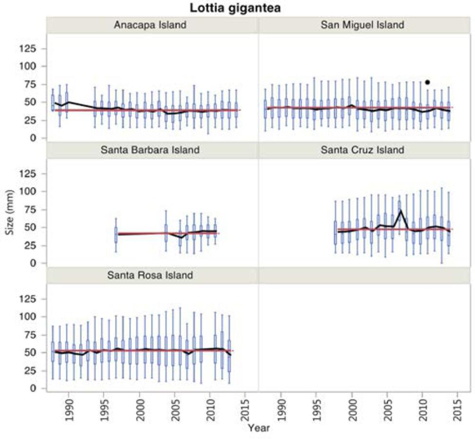

```{r, include=F}
knitr::opts_chunk$set(echo=F, message=F, warning=F, error=F)
source(here::here("scripts/utility.R"))
```
```{r}
get_modal_info()
```

## Owl limpets (_Lottia gigantea_)

## {.tabset}

### Mean number by island


### Size frequency by island



##

`r md_caption("Figure App.F.13.3.")`